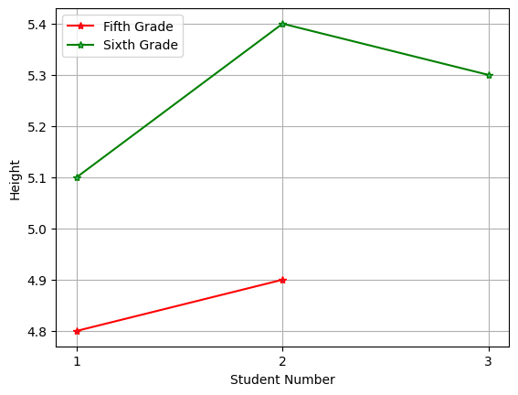

# About This Project
## The Purpose of This Project
A short test of **K Nearest Neighbors**, not for anything. _Just for classes and to add to documentation_. This was used as my first repository for my Machine Learning class. It is a simple test using plotting and simple prediction using the K Nearest Neighbors algorithm. The original code was made in Google Colab and has since been housed in my documentation. I couldn't care less about this code because it is simply a learning opportunity as well as an opportunity to learn how to use Github.
### Stuff To Know
This has an **MIT License**. If you are wondering about any errors, you might wanna read the documentation section here. This was written for a specific lesson in a curriculum, so this is only part of something much bigger. Hopefully by the time you are reading this, I will have more things on my profile, not just this(this is my first thing by the way). Another thing, the reason that there seems like there is some weird gap in the typing for my documentation is because in between the two sections  you see, there used to be  code. Obviously, we don't need that in this text file because it is just the exact thing. 

## What is KNN? 
_KNearestNeighbors is an algorithm that classifies an object into a category based on the data you give it and what the proximity between the data and the object._ 
For example, if apples are 5 and 6 and oranges are 9 and 12, and you give the algorithm the number 4, the closest number to four is 5, which is classified as an apple, therefore, four would be classified as an apple. 
Nearest means closest, and Neighbors means next to. 
The K is the trickiest part, it means how many neighbors. For example, with our apple and oranges thing, if we choose 3 neighbors for the number four, the neighbors would be 5,6, and 9. Now this would make it an apple because only one of the neighbors is an orange. The majority wins here because apples have 2 neighbors.  With small datasets, it is best to keep the K to one. With bigger datasets, you can up it to your liking. 
This specific project was created to be my first venture into KNN

## My Documentation
Here is what I wrote about this specific code in my documentation: 

### Brief Notes
This is the second iteration of the code. This is more automatic rather than manual, but it still looks the same as the old line plot. The only thing is that this one doesn’t require you to type in the array manually, you just have to use masking to pull some things out and then you can plot with those. The upside of using masking is that if you add another datapoint, it will still get masked and then included in the dataframe. Same thing if you have a million new data points, you won’t have to type them in manually. Just type in a mask and you will be done. With that said, here’s the code: 

### Long Notes  
There’s a lot to notice here. Especially the **complex masking system** that was used for the switch from manual to automatic. I think we need to explain this in detail in order to be able to move on any further in this documentation. Like in the first iteration, I was a fan of having the 5th and 6th grade arrays separate because then I could use separate labels, colors, and markers on the lines in order to be able to have a more usable plot that you could use to look at and easily compare heights. In order to do this, there are **two** masks, one that takes out the fifth graders into their own array, and one that takes out the 6th graders into their own array. The names are a little bit wonky, but names can always be changed. In fact, if you want to go change the names and tinker with the code, here you go: Link to KNC Plotting. Your homework after reading through this entire documentation will be to go to this link and experiment. I’m putting my trust in you to complete this. Anyways, the fifth graders are taken out by a simple mask, where we just make sure it equals 5. If you have super sharp eyes like me, **you might notice that we use this ymask on x. The reason for this is because the actual value of ymask is simply true true false false false, we can apply that onto x and it will assume that the first two are true. Which because we made sure in the first step that the data corresponds nicely, is actually a true assumption from the computer.  This holds true for the 6th graders as well.** Because they are still separated, our ending plot will still look similar to the last iteration, but if you play around and add a datapoint, it will still filter through and work just fine. After that, the plots look normal. One of the other important differences is that there are no numbers on the xticks or x axis. 

# Graph Results
Here are the results from the graph that I made in this code. 

